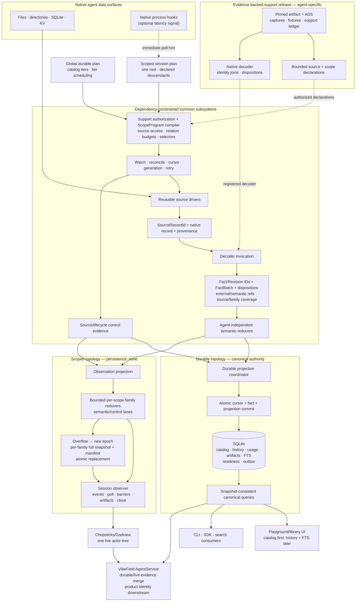

# RFC 012: Evidence-backed adapters and progressive readiness — umbrella architecture

- **Status:** Ratified umbrella architecture; child contracts remain
  independently ratifiable
- **Created:** 2026-08-15
- **Ratified:** 2026-08-15
- **Reorganized:** 2026-08-15 into independently ratifiable child RFCs
- **Authors:** James Yong, contributors
- **Target:** `spaghetti`
- **Type:** Umbrella architecture and program governance
- **Scope:** the shared architectural center for agent adaptation, progressive
  durable readiness, common runtime semantics, and database-free scoped
  observation
- **Program plan:** [RFC 012 implementation and validation plan](./archive/012-implementation-plan.md)
- **Evidence:** [playground cold-start profile](./011-playground-cold-start-profile-2026-08-15.md),
  [Phase 0 catalog evidence](./archive/012-phase-0-census-2026-08-15.md), and
  [Phase 0B runtime evidence](./archive/012-runtime-observation-census-2026-08-15.md)
- **Downstream requirements:**
  [VibeField aggregation and contribution needs](../petition/vibefield-needs.md)
- **Foundation:** [RFC 011](./011-rust-observation-query-engine.md)
- **Amends:** the RFC 011 contracts enumerated in section 4.4; every other RFC
  011 invariant remains in force

## Child RFCs

| Child RFC                                                                                                    | Normative ownership                                                                     | Status   |
| ------------------------------------------------------------------------------------------------------------ | --------------------------------------------------------------------------------------- | -------- |
| [RFC 012A: Agent adaptation and common-engine boundaries](./012a-agent-adaptation-and-engine-boundaries.md)  | dependency law, base/external/semantic identity, coverage, ADS/scope, support policy    | Ratified |
| [RFC 012B: Catalog, readiness, and progressive startup](./012b-catalog-readiness-and-progressive-startup.md) | catalog/project evidence, reference resolution, coverage readiness, pagination, startup | Implemented; ratification pending |
| [RFC 012C: Runtime semantic contracts and usage-v2](./012c-runtime-semantics-and-usage-v2.md)                | runtime reducers/usage/interactions, durable/live reconciliation, usage migration       | Implemented; ratification pending |
| [RFC 012D: Database-free session-scoped observation](./012d-session-scoped-observation.md)                   | observer lifecycle/versioning, semantic refs/coverage, epochs, artifacts, Chopsticks    | Implemented; ratification pending |

Each child is an independent ratification unit. Approving this umbrella does
not freeze every child API shape or numeric performance target. 012B, 012C, and
012D were trimmed on 2026-08-23 to the contract the code enforces; their full
2026-08-15 drafts are in [archive/](./archive/).

## Landing status (2026-08-23)

The normative text below is unchanged and still ratified. This section says
where each umbrella decision now lives, so a reader can tell an implemented
invariant from an intention.

**Execution authority is [the RFC 012 landing plan](./012-landing-plan.md)**:
§3 is the landing surface (what the program must deliver, per consumer), §8 is
the per-lane status with commits and measurements, and
[§8a](./012-landing-plan.md#8a-follow-ups-filed-during-the-landing-not-blockers)
lists the follow-ups filed during the landing — none of them blockers.
Measurements live in [the performance report](./012-landing-perf-report.md).
The plans this RFC's front matter used to point at are retired and archived.

| §3 umbrella decision | State | Where it lives |
| --- | --- | --- |
| 1. One decode/provenance spine | implemented | `crates/spaghetti-napi/src/{core,source}/` + `decode_runtime.rs`; the observer decodes through the same `decode_record` (`src/observer/mod.rs`) |
| 2. Common owns mechanics, adapters own interpretation | implemented | `src/adapter/` declares the seam; `src/claude/runtime_facts.rs` interprets — all eleven families emitted (lane L5) |
| 3. Evidence-backed agent support | implemented | `agent-support/`, `scripts/agent_support/validate.py` |
| 4. Catalog membership is a first-class fact | implemented | `src/engine/catalog/` — [012B](./012b-catalog-readiness-and-progressive-startup.md) |
| 5. Readiness is a vector | implemented | `Readiness` in `src/engine/catalog/readiness.rs`, generated to `packages/sdk/src/generated/Readiness.ts` |
| 6. Catalog readiness is the interactive boundary | implemented | `startConfiguredObservation`; 122 ms cold / 8 ms warm on the real corpus |
| 7. Startup tier separate from dynamic urgency | partial | catalog-first ships; the four-tier scheduler and `requestHydration` do not — 012B §8 |
| 8. All sources planned before full history | implemented | one bounded discovery pass per configured source, committed before history |
| 9. Queries are pure | implemented | `src/engine/catalog/query.rs`, `src/engine/usage_query.rs` |
| 10. One database authority | implemented | the observer opens no store; `src/observer/` has no rusqlite dependency |
| 11. Scoped observation is first-class and non-persistent | implemented | `src/observer/` — [012D](./012d-session-scoped-observation.md) |
| 12. Durable and scoped share semantics | implemented | `src/runtime_semantic_reducer.rs`, imported by both sinks |
| 13. Actor identity and qualified evidence on runtime facts | implemented | `ActorRef` on every observer event; qualified buckets in `usage_query.rs` |
| 14. Response-level Claude usage | implemented | 78.52B → 36.88B tokens, 2.129× — [012C](./012c-runtime-semantics-and-usage-v2.md) §6 |
| 15. Explicit observer continuity | implemented | watch-before-scan, reset-before-replay, epochs, overflow → full replacement; 28 behavioural tests |
| 16. Aggregators join evidence, not delivery accidents | implemented as types; no shipped joiner | one `v1:` spelling for every opaque reference; `ExternalEntityRef`, `SemanticRevisionRef`, `atCommitSeq` — [docs/integration/vibefield-phase-a.md](../integration/vibefield-phase-a.md) |
| 17. Product identity and contribution stay downstream | held | nothing shipped decides aliases, cross-device groups, or contribution |
| 18. Physical extraction is incremental | held | still one crate; the ratchets in `scripts/code_shape/` enforce shape instead |

Three things a reader should not infer from the table.

**The rebuild is minutes, not hours.** `SCHEMA_VERSION` 64 forces a full rebuild
at first start: the catalog appears in about 100 ms, and history and search
converge in the background — about 12 minutes (725 s, all eleven fact
families) on a 3.2 GB Claude corpus, after durable ingest went from 70 to
11,653 records/s (166×) on a frozen 301 MB corpus. Both root causes and the trade-offs accepted are in
[the performance report](./012-landing-perf-report.md).

**"Implemented" for the fact families means all eleven are emitted with typed
values** — not that every family has equally strong native evidence. Two
documented limits: plan revisions come from `ExitPlanMode`/`EnterPlanMode` tool
evidence rather than from `plans/<slug>.md` sidecars, which stay snapshot facts
with no actor binding; and a `tool_result` whose call fell outside the bounded
correlation window keeps its content-block evidence without a guessed tool
name. Both are in [012C](./012c-runtime-semantics-and-usage-v2.md) §7.

**Revision identities changed for eight of those families.** `message`,
`content_block`, `tool`, `user_input_request`, `plan`, `task`, `native_marker`,
and `effective_state` now derive a revision from the record that proved the
value rather than from the value alone, because those entities outlive any one
record. Entity identities are unchanged; `FactRevisionId` for those families is
not. See [012C](./012c-runtime-semantics-and-usage-v2.md) §3.1.

Two process facts that are part of the architecture, not incidental to it:
support releases are `agent-support/<adapter>/<date>/` with a single `version`
field, and **promoting a real Claude, Codex, or Grok release requires a named
human sanitizer review plus a performance report** — the validator refuses
placeholders, so `fixture-agent` remains the only promoted release
([012A](./012a-agent-adaptation-and-engine-boundaries.md) landing status).

## 1. Summary

Spaghetti will standardize agent support as an evidence-backed adaptation
process and make application readiness progressive rather than synonymous with
complete transcript, projection, and full-text-search convergence.

One authoritative decode spine turns native source records into common facts.
Agent adapters describe native sources, select bounded common mechanics, and
interpret native evidence; they do not own storage, queries, readiness,
watchers, cursors, queues, or public delivery.

Those common facts feed two execution topologies:

1. a durable host that commits canonical projections to the sole authoritative
   database and exposes complete, versioned queries; and
2. a database-free observer for one known native session and its current/future
   actor tree, used by low-latency consumers such as Chopsticks Godview.

The desktop exposes a complete or explicitly degraded project/session catalog
first. History, usage, artifacts, search, audits, and maintenance continue in
the background. A selected session may be promoted through an explicit
scheduling command. Queries remain pure and report completeness; they do not
silently trigger ingest or repair.

This umbrella ratifies that architectural center. Child RFCs own the detailed
semantic contracts and may mature at different rates.

## 2. Motivation and evidence

### 2.1 The current interactive boundary is too late

The 2026-08-15 production-shaped profile reached host readiness after 206.89
seconds, processing 1,969,824 native records into an approximately 8.25 GB
database. That boundary included all three adapters, complete history,
full-text-search finalization, integrity work, and final checkpoints. It did
not isolate time to a display-ready library.

The current host serializes important adapter work and withholds the query
client until global completion. The presentation layer then performs more
usage/task fan-out to build project/session summaries. Users wait for the full
analytical database even though the initial product need is a catalog.

### 2.2 Catalog discovery is much smaller than full convergence

The independent Phase 0 census found all 176 oracle projects and all 1,414
oracle catalog sessions while reading 0.832% of the selected primary-stream
bytes. Its Python feasibility implementation completed in 535.7 ms with 45.4
MiB peak RSS.

Claude also exposed 181 index-only sessions beyond transcript-backed canonical
sessions. Omitting them would make discovery incomplete; representing them as
fully decoded would be false. Therefore:

```text
discoverable != transcript-backed != hydrated != searchable
```

### 2.3 Runtime consumers need a non-durable lane

Chopsticks currently consumes a no-SQLite single-session transcript tail.
Requiring it to open the global durable host would add a database, global root
configuration, whole-source discovery, and coarse invalidations to a use case
that already knows the native root session.

The answer cannot be a second agent parser. Runtime observation must reuse the
same source identities, drivers, adapter decoders, facts, generations, and
semantic reducers as durable ingestion while remaining explicitly
non-authoritative.

### 2.4 Existing usage semantics are incorrect

The Phase 0B census found 342,861 usage-bearing Claude rows but only 149,077
file-scoped response groups, including 193,784 repeats, 57,150 groups with
evolving counters, 111 downward corrections, missing request IDs, and request
IDs shared by multiple message IDs.

Usage must therefore be a response-level replaceable snapshot rather than an
additive contribution per JSONL row. This is a reviewed semantic migration,
not a performance shortcut.

## 3. Umbrella decisions

1. **One native decode and provenance spine remains authoritative.** Catalog,
   history, runtime semantics, usage, artifacts, and search cannot introduce
   parallel native parsers for convenience.
2. **The common side owns mechanics; adapters own native interpretation.** The
   exact dependency law and extension process belong to RFC 012A.
3. **Agent support is evidence-backed.** Promoted support ties native artifacts,
   ADS claims, fixtures, decoder versions, and conformance evidence together.
4. **Catalog membership is a first-class semantic fact.** It remains distinct
   from transcript and search completeness.
5. **Readiness is a durable vector.** Catalog, session history, usage,
   capabilities, artifacts, and search progress independently.
6. **Catalog readiness is the desktop interactive boundary.** Full-search
   readiness remains a separate goal for consumers that require search.
7. **Startup tier and dynamic urgency are separate.** Catalog-first semantics do
   not authorize unbounded parallel production.
8. **All configured sources enter global planning before full history work.**
   One slow adapter cannot hide the others from the initial library.
9. **Queries are pure.** Hydration and priority promotion are explicit commands
   on the writer/scheduler side.
10. **One database remains the sole durable and canonical-query authority.** No
    renderer index, TypeScript side database, or observer cache becomes another
    authority.
11. **Session-scoped observation is a first-class non-persistent topology.** It
    follows one declared root actor tree without SQLite or unrelated global
    enumeration.
12. **Durable and scoped topologies share native semantics.** They use the same
    source identity, driver, generation, decoder, fact, provenance, and common
    reducer contracts.
13. **Runtime facts carry actor/run identity and qualified evidence.** Team and
    workflow affiliations are orthogonal rather than actor kinds.
14. **Claude usage moves to response-level snapshot revisions.** Exact repeat
    rows do not add usage; downward corrections remain valid.
15. **Observer continuity is explicit.** Watch-before-scan,
    reset-before-replay, bounded delivery, deterministic event identity, and
    full epoch replacement after overflow are semantic requirements.
16. **External aggregators join evidence, not delivery accidents.** Stable
    external entity references, semantic revision references, and comparable
    source-coverage evidence connect durable queries to scoped observation;
    database commit sequence and observer sequence are never treated as one
    clock.
17. **Product identity and contribution remain downstream.** Spaghetti exposes
    native project/session/actor association evidence but does not decide user
    aliases, cross-device groups, repository policy, or contribution claims.
18. **Physical extraction is incremental.** Logical dependency laws are
    enforced before final crate names or a big-bang workspace split.

## 4. Normative ownership and precedence

### 4.1 Classification vocabulary

Every material decision is classified as one of:

| Classification          | Meaning                                                                 |
| ----------------------- | ----------------------------------------------------------------------- |
| `ArchitectureInvariant` | Cross-program law; implementation and child RFCs cannot violate it      |
| `SemanticContract`      | Observable meaning, identity, state transition, or correctness rule     |
| `ProposedApi`           | Candidate language/wire representation of an approved semantic contract |
| `ImplementationDetail`  | Replaceable design that cannot change public semantics                  |
| `ExperimentTarget`      | Value or strategy to measure; not a release blocker until promoted      |
| `OpenQuestion`          | Decision intentionally deferred to named evidence or amendment          |

### 4.2 Single-owner rule

Each detailed normative rule has one owner:

- this umbrella owns cross-cutting architecture invariants;
- RFC 012A owns adaptation, common/adapter boundary details, stable external
  entity/semantic-revision references, and common source-coverage semantics;
- RFC 012B owns catalog/readiness/startup and native project-association
  evidence details;
- RFC 012C owns runtime fact, usage-v2, and durable/live runtime-reconciliation
  details; and
- RFC 012D owns scoped-observer delivery details.

Other documents summarize and link; they do not restate a competing contract.
Shared base-model concepts such as `QualifiedValue` are owned by RFC 012A and
constrained, not redefined, by consumers.

### 4.3 Precedence

1. A child cannot weaken an umbrella invariant without an explicit umbrella
   amendment.
2. Within a child's ownership domain, the ratified child contract controls over
   umbrella summaries and the implementation plan.
3. A sibling RFC cannot redefine another sibling's owned semantics. It imports
   them by reference.
4. Evidence reports describe measured facts; they do not create architecture
   law unless a ratified RFC cites the result as a decision basis.
5. The implementation plan sequences work and records gates; it is not a
   semantic authority.
6. Pseudocode specifies semantic fields unless explicitly marked as a frozen
   serialized or public API representation.

When documents conflict, implementation stops until the owning RFC is amended;
code cannot choose a preferred interpretation silently.

### 4.4 Relationship to RFC 011

RFC 011 remains the durable-engine foundation. RFC 012 intentionally changes
several of its contracts to add progressive readiness, a non-persistent
observation topology, and aggregate-facing durable/live reconciliation. The
following delta ledger is normative:

| Contract ID                     | RFC 011 area                                                                                                          | RFC 012 disposition                                                                                                                                               | Controlling contract                                   |
| ------------------------------- | --------------------------------------------------------------------------------------------------------------------- | ----------------------------------------------------------------------------------------------------------------------------------------------------------------- | ------------------------------------------------------ |
| `X0-DB-AUTHORITY`               | One Rust database owner, one durable writer, typed pure queries, and asynchronous database access                     | Retained                                                                                                                                                          | RFC 011 plus this umbrella                             |
| `X0-RECONCILIATION-ORDER`       | Notifications are hints; reconciliation, generation, and per-object source order are authoritative                    | Retained                                                                                                                                                          | RFC 011 plus RFC 012A                                  |
| `X0-ADAPTER-BOUNDARY`           | Adapters emit side-effect-free facts and receive no Spaghetti database, query, watcher, cursor, or delivery authority | Strengthened                                                                                                                                                      | RFC 012A                                               |
| `X0-DECODE-TOPOLOGY`            | “Same decoder and projections” for backfill/live                                                                      | Amended to the same source-record identity, decoder, fact, provenance, and semantic-reducer contracts; durable and scoped delivery projections are distinct       | This umbrella and RFC 012A                             |
| `X0-DURABLE-ATOMICITY`          | Cursor/fact/projection/outbox atomicity and publish-after-commit                                                      | Retained for the durable topology; not imposed on the non-persistent scoped topology                                                                              | RFC 011 for durable work; RFC 012D for scoped delivery |
| `X0-SCOPED-OBSERVATION`         | Runtime observation is served only through the durable writer/change log                                              | Amended: source-derived runtime meaning is still one semantic plane, but RFC 012D may deliver it through a database-free, non-authoritative scoped topology       | This umbrella and RFC 012D                             |
| `X0-DECLARED-ADAPTER-MECHANICS` | Adapter `discover`/`reconcile_entity` or custom-producer escape hatches                                               | Superseded wherever they permit undeclared enumeration, private production mechanics, or unbounded joins; only RFC 012A declarations and restricted joins conform | RFC 012A                                               |
| `X0-USAGE-V2`                   | RFC 011 `UsageFact`, accounting mode, and value-quality representation                                                | Superseded for canonical usage-v2 by response-keyed qualified revisions; retained only as an explicitly versioned legacy migration path                           | RFC 012C                                               |
| `X0-CATALOG-READINESS`          | Generic projection readiness and `StaleSafe` representation                                                           | Refined for the catalog into an epoch-, coverage-plan-, and snapshot-based state machine; other packs retain versioned readiness appropriate to their contracts   | RFC 012B                                               |
| `X0-COMMON-FACTS`               | Common message/content/run facts and deterministic fact identity                                                      | Retained unless a versioned RFC 012A/012C contract explicitly refines the representation                                                                          | RFC 012A and RFC 012C                                  |
| `X0-CROSS-TOPOLOGY-IDENTITY`    | Stable source-instance keys and deterministic fact revisions                                                          | Strengthened into persistable external entity references and mandatory cross-topology semantic revision references                                                | RFC 012A                                               |
| `X0-FIXED-SNAPSHOT-PAGINATION`  | Per-query-result `at_commit_seq` and stable keyset pagination                                                         | Retained per result; strengthened for aggregate-facing history/runtime continuations to bind one retained snapshot or fail explicitly                             | RFC 011 plus RFC 012C                                  |
| `X0-DURABLE-LIVE-HANDOFF`       | Durable query watermark to live-update handoff                                                                        | Refined: `at_commit_seq` remains the durable clock, while common per-source/family coverage and semantic revision references reconcile scoped evidence            | RFC 012A and RFC 012C                                  |

This table is exhaustive for intentional RFC 011 changes in the RFC 012
program. An unlisted conflict is not implicitly superseded: implementation
stops until this ledger or the owning child contract is amended.

The executable mirror of this ledger is
[`scripts/architecture/rfc012-rfc011-delta.json`](../../scripts/architecture/rfc012-rfc011-delta.json).
Its validator treats missing or unclassified rows as errors and has a stricter
release mode that also rejects planned-but-not-yet-implemented evidence.

## 5. Ratification matrix

| Topic                                                        | Classification          | Normative owner | Umbrella position       |
| ------------------------------------------------------------ | ----------------------- | --------------- | ----------------------- |
| One decode/provenance spine                                  | `ArchitectureInvariant` | RFC 012         | Ratified                |
| One durable/query database authority                         | `ArchitectureInvariant` | RFC 012         | Ratified                |
| Durable and ephemeral topologies share semantics             | `ArchitectureInvariant` | RFC 012         | Ratified                |
| Common subsystem dependency law                              | `ArchitectureInvariant` | RFC 012A        | Ratified                |
| Cross-topology entity/source-record/fact identity            | `SemanticContract`      | RFC 012A        | Ratified                |
| External entity/native-identity/semantic-revision references | `SemanticContract`      | RFC 012A        | Ratified                |
| Common source/family coverage semantics                      | `SemanticContract`      | RFC 012A        | Ratified                |
| Tier/view compositionality                                   | `SemanticContract`      | RFC 012A        | Ratified                |
| ADS, source/scope declarations, support ledger               | `SemanticContract`      | RFC 012A        | Ratified                |
| Exact support-ledger serialization                           | `ProposedApi`           | RFC 012A        | Provisional             |
| Catalog membership fact                                      | `ArchitectureInvariant` | RFC 012         | Ratified                |
| Catalog identity/reducer law                                 | `SemanticContract`      | RFC 012B        | Child approval required |
| Native session/project association evidence                  | `SemanticContract`      | RFC 012B        | Child approval required |
| Persisted catalog-reference resolution                       | `SemanticContract`      | RFC 012B        | Child approval required |
| Catalog coverage-plan identity/lifecycle                     | `SemanticContract`      | RFC 012B        | Child approval required |
| Readiness transition state machine                           | `SemanticContract`      | RFC 012B        | Child approval required |
| Snapshot-consistent catalog cursor                           | `SemanticContract`      | RFC 012B        | Child approval required |
| Exact catalog request structs                                | `ProposedApi`           | RFC 012B        | Provisional             |
| Response-snapshot usage direction                            | `ArchitectureInvariant` | RFC 012         | Ratified                |
| Qualified usage buckets and actor attribution                | `SemanticContract`      | RFC 012C        | Child approval required |
| Typed runtime fact families                                  | `SemanticContract`      | RFC 012C        | Child approval required |
| Runtime reducer/replacement family law                       | `SemanticContract`      | RFC 012C        | Child approval required |
| Durable/live runtime reconciliation                          | `SemanticContract`      | RFC 012C        | Child approval required |
| usage-v2 migration/oracle                                    | `SemanticContract`      | RFC 012C        | Child approval required |
| Database-free scoped observer topology                       | `ArchitectureInvariant` | RFC 012         | Ratified                |
| Observer lifecycle, IDs, epochs, control lane                | `SemanticContract`      | RFC 012D        | Child approval required |
| Observer version selection/family manifests                  | `SemanticContract`      | RFC 012D        | Child approval required |
| Observer semantic-reference/coverage transport               | `SemanticContract`      | RFC 012D        | Child approval required |
| Exact observer method/wire shapes                            | `ProposedApi`           | RFC 012D        | Provisional             |
| Numeric latency/RSS/byte goals                               | `ExperimentTarget`      | RFC 012B/012D   | Not yet release law     |
| Scheduler weights and queue capacities                       | `ImplementationDetail`  | Program plan    | Replaceable             |
| Physical crate names                                         | `ImplementationDetail`  | Program plan    | Replaceable             |
| Dynamic adapter loading                                      | `OpenQuestion`          | Future RFC      | Deferred                |
| Historical `code.activity`/runtime own-actions               | `OpenQuestion`          | Future RFC      | Deferred                |

Approving a semantic direction does not automatically approve every proposed
representation in that child document.

## 6. Architecture



The diagram names logical responsibilities, not mandatory crate boundaries.
RFC 012A defines allowed and forbidden dependencies among them.

## 7. Common vocabulary

### 7.1 Agent Data Surface

A versioned, evidence-linked model of one native agent's sources, identities,
joins, lifecycle, bounds, version markers, quality, privacy, and scope
relationships. RFC 012A owns the complete contract.

### 7.2 Support release

A promoted binding of vendor artifact/range, ADS, adapter decoder, fixtures,
Spaghetti durable/observation contract versions, platforms, and conformance
evidence.

### 7.3 Catalog evidence

Evidence that a project/session is discoverable and can be represented in the
library without claiming complete transcript hydration. RFC 012B owns its fact
and reducer semantics.

### 7.4 Projection pack

A transactionally maintained group of canonical rows, queries, readiness, and
invalidation semantics for one consumer capability.

### 7.5 Hydration

Explicit background work that advances an entity or projection pack from
catalog-only evidence toward its complete supported representation.

### 7.6 Observation scope and epoch

One explicitly identified native root session plus only declared related
actors/objects. An epoch is one complete observer-owned state lineage; overflow
invalidates it and RFC 012D resync replaces it atomically.

### 7.7 Qualified value

A value plus authority, quality, completeness, effective time, and provenance.
Unknown and exact zero are different. RFC 012A owns the base meaning.

### 7.8 External entity and semantic revision references

An external entity reference is the persistable, restart-stable view of one
RFC 012A base entity key. A semantic revision reference is the common durable
query/scoped-observer join identity for one typed native-derived fact revision.
Neither is a database row ID, page handle, attachment ID, or delivery sequence.
RFC 012A owns both contracts.

### 7.9 Source/family coverage

A driver-aware vector describing which source object/generation positions have
been decoded or projected for a declared domain. It is distinct from durable
commit order and observer delivery order. RFC 012A owns comparison semantics;
RFC 012C owns aggregate-facing retirement rules.

## 8. Cross-cutting invariants

The following are release-blocking across every child:

1. A native record has one authoritative decoding and provenance path.
2. Scheduling may change completion order, never final semantics.
3. A durable cursor cannot commit without all facts/projection effects of that
   commit.
4. Catalog evidence and transcript evidence remain distinguishable.
5. Missing, unknown, native-claimed, derived, estimated, and exact remain
   distinguishable.
6. Durable readiness cannot become ready before the rows it describes commit.
7. A public query cannot mutate or repair the state it reads.
8. A crash may delay convergence but cannot expose partial work as complete.
9. Filesystem notifications remain hints; source reconciliation remains truth.
10. Durable and scoped topologies cannot use different native decoders for the
    same record family/support release.
11. A scoped observer cannot claim persistence, durable completeness, or query
    authority.
12. Cold bootstrap is not a fabricated rewrite/reset.
13. True replacement/discontinuity increments generation and orders reset before
    corrected replay.
14. Response usage revisions replace the prior response contribution; exact
    repeats do not add usage and downward corrections remain valid.
15. Every native-derived observation has deterministic identity and qualified
    provenance.
16. Bounded delivery cannot silently drop evidence and continue claiming
    continuity.
17. One slow source/scope cannot starve other catalog, live, or scoped work.
18. Adapter tests cannot derive expected results from adapter code.
19. No adapter receives Spaghetti database/query/delivery authority.
20. No child contract may introduce another native parser, durable authority,
    or presentation-owned canonical state.
21. Reading the same logical native record through different authorized tiers,
    views, or topologies cannot change its source-record, fact, or revision
    identity.
22. A shared semantic family must reduce to the same state at the same
    comparable RFC 012A source/family coverage vector in durable and scoped
    topologies, modulo explicitly declared persistence- and delivery-only
    metadata.
23. Every typed native-derived semantic revision that can appear through both
    durable query and scoped observation exposes the same RFC 012A
    `SemanticRevisionRef`; a delivery event ID, observer sequence, or database
    row ID cannot replace that join identity.
24. Durable commit sequence, observer sequence, and native source position are
    distinct clocks. Overlay evidence may be retired only by matching semantic
    identity or by common source/family coverage that proves the durable state
    subsumes it; an invented global native scalar is prohibited.
25. Catalog rows, aggregate-facing durable runtime/history items, and scoped
    observer roots for the same base session expose an equal persistable RFC
    012A `ExternalEntityRef`; a product alias or presentation representative
    cannot silently replace it.

## 9. Child scopes and dependencies

### 9.1 RFC 012A — foundation

RFC 012A defines logical subsystems, dependency checks, common source
primitives, stable source-instance and external entity references, base
entity/source-record/fact/semantic-revision identity, common source/family
coverage, tier compositionality, restricted scope relations, ADS workflow,
support releases, version compatibility, fixtures, and conformance.

It must be approved before a new adapter contract is promoted. Its logical laws
can land before physical crate extraction.

### 9.2 RFC 012B — durable interactive path

RFC 012B defines catalog facts, native project/session association evidence,
identity/reducer precedence, external catalog-reference resolution, evidence
loss, coverage-plan-bound snapshot pagination/readiness transitions,
catalog-first startup, warm migration classification, scheduling, UX, and
catalog performance gates.

It depends on RFC 012A but not on runtime observation.

### 9.3 RFC 012C — shared runtime meaning

RFC 012C defines actor/run and affiliation facts, qualified usage-v2 response
revisions, common runtime reducer/replacement laws, aggregate-facing durable
history/runtime snapshot and overlay-reconciliation semantics, message/content
and effective model/effort/mode evidence, plan/task/tool/progress facts,
structured interactions, capability quality, and durable usage migration.

It depends on RFC 012A and remains independent of delivery topology.

### 9.4 RFC 012D — ephemeral delivery

RFC 012D composes RFC 012A scope mechanics and transports RFC 012C facts. It
defines observer access, envelope/event identity, actor-tree discovery,
bootstrap/reset/poll ordering, semantic and control lanes, epoch replacement,
contract-version selection, per-family replacement manifests, artifact reads,
fairness, and Chopsticks migration.

Detailed RFC 012D ratification follows RFC 012C semantic ratification, although
its store-free skeleton and source-lifecycle tests may be implemented in
parallel behind internal contracts.

## 10. Program boundaries

### 10.1 Goals

- make agent addition/update repeatable and evidence-backed;
- show all discoverable projects/sessions before history/FTS convergence;
- serve a safe last-complete catalog immediately on warm start;
- expose completeness and value quality honestly;
- let local downstream aggregators reconcile durable and scoped evidence
  without guessing identity or watermark equivalence;
- keep mechanics reusable across file, directory, SQLite, and KV agents;
- give runtime consumers low-latency scoped observation without another parser
  or database;
- correct usage semantics with an independently validated migration; and
- preserve deterministic convergence, crash safety, and rollback.

### 10.2 Non-goals

This program does not:

- define one universal vendor transcript schema;
- make every display/runtime field available at catalog readiness;
- permit partial FTS results to masquerade as complete;
- define a stable third-party dynamic Rust plugin ABI;
- replace exact native evidence with fixtures generated from adapter code;
- expose production captures in the repository;
- make the observer a durable replay/query store;
- move model-capacity or Godview burn-rate presentation into Spaghetti;
- define VibeField project/session IDs, aliases, merge/split decisions,
  cross-device project groups, mesh routing, or user identity;
- calculate contribution percentages, human-versus-agent attribution,
  accepted-branch policy, repository lineage, or Git analytics;
- freeze final crate names before dependency laws are proven; or
- ratify provisional numeric targets through this umbrella alone.

## 11. Compatibility and rollout

The existing blocking full-search startup, legacy usage query, and
`watchSessionTranscript` remain explicit compatibility paths while their owning
children are implemented and validated.

Rollout rules:

1. additive child contracts and shadow paths land before behavior switches;
2. durable changes retain differential or independent-oracle validation;
3. catalog-first startup remains feature-flagged through cold/warm/crash and UI
   conformance;
4. usage-v2 retains the legacy projection during its compatibility window;
5. scoped observation retains the old tail until Chopsticks passes its full
   epoch/reset/runtime matrix;
6. rollback changes scheduling/query selection or ephemeral observer choice,
   not database authority; and
7. no compatibility shortcut creates a new native parser or persistent store.

Child approval is independent: for example, catalog-first startup may be
approved without declaring the observer wire shape final. Default program
rollout requires all child gates needed by that product path.

## 12. Cross-cutting security and privacy

- Production raw captures are never committed.
- Sanitization is deterministic, auditable, and tested for prohibited fields.
- Source and artifact access is canonicalized, bounded, policy checked, and
  attributable to a promoted declaration.
- Experiment reports contain aggregate counts and hashes, not native paths,
  IDs, prompts, titles, questions, or payloads.
- Unknown/unverified vendor evidence follows conservative retention policy.
- Catalog stores only product-required display evidence with provenance.
- Observer raw evidence is local, scope-bound, and explicitly withheld when
  policy denies it.
- Neither adapter nor renderer receives a Spaghetti database handle.

## 13. Rejected umbrella alternatives

### 13.1 Parallelize every existing full adapter at startup

Rejected because it preserves the wrong readiness boundary and can worsen
writer contention without producing an early catalog.

### 13.2 A second fast catalog authority

Rejected because identity, deletion, migrations, and query meaning would drift.

### 13.3 A second runtime transcript parser

Rejected because Godview and durable state would disagree on reset, identity,
usage, and unknown evidence.

### 13.4 One global readiness Boolean

Rejected because catalog, session history, usage, capabilities, artifacts, and
search have different completeness boundaries.

### 13.5 One universal `AgentTranscript`

Rejected because agents expose append files, replacement documents,
directories, SQLite, KV stores, and different identity/usage semantics. Common
facts unify consumer meaning without erasing native evidence.

### 13.6 Big-bang physical rewrite before contracts

Rejected because physical movement does not prove dependency direction and
would delay user-visible/catalog and downstream-observer work.

## 14. Cross-program open questions

These questions require named evidence or a future amendment:

1. final ratified numeric catalog and observer latency ceilings after Rust
   implementation measurements;
2. FTS build strategy after catalog: deferred one-shot, incremental, or bounded
   chunked finalization;
3. partial selected-session transcript visibility if complete-page hydration
   misses calibrated product gates;
4. dynamic adapter loading after compiled boundaries survive at least one new
   adapter; and
5. long-term support-ledger distribution and signing beyond the local compiled
   v1 model; and
6. a future evidence-backed `code.activity` pack for historical/unmanaged file
   and repository-command evidence, including whether and how to ingest
   versioned Chopsticks own-action records. It is not a managed-contribution-v1
   or RFC 012 release gate.

## 15. Umbrella acceptance criteria

RFC 012's architecture program is complete when:

- all four child RFC semantic contracts are ratified or explicitly scoped out
  of the promoted product path;
- RFC 012A proves dependency, adaptation, access, version, and new-agent gates;
- RFC 012B presents a snapshot-consistent complete/degraded catalog before
  history/FTS and preserves safe warm presentation;
- RFC 012C passes the independent qualified usage-v2 oracle and typed runtime
  conformance;
- RFC 012D passes database-free scoped observation, epoch replacement,
  confinement, fairness, and Chopsticks migration gates;
- one decode/provenance spine feeds both durable and scoped topologies;
- RFC 011 retained/amended/superseded behavior passes the section 4.4
  compatibility matrix;
- identical supported source records produce identical fact/revision digests
  and reduced semantic state in durable and scoped topologies at the same
  comparable RFC 012A source/family coverage vector;
- persistable external entity references resolve without restart-dependent
  handles, and aggregate-facing durable/scoped items expose matching semantic
  revision references and comparable source/family coverage;
- native project association remains provenance-bearing evidence rather than a
  downstream product identity or contribution claim;
- no renderer, adapter, or observer becomes another durable/query authority;
- child-specific numeric release gates have been ratified from reproducible
  reports and pass;
- legacy paths remain available through their stated compatibility windows;
- cold, warm, live, restart, reset, deletion, migration, crash, and rollback
  matrices pass; and
- the accepted final durable query/FTS digests and explicit usage-v2 oracle
  digests match their frozen evidence.
